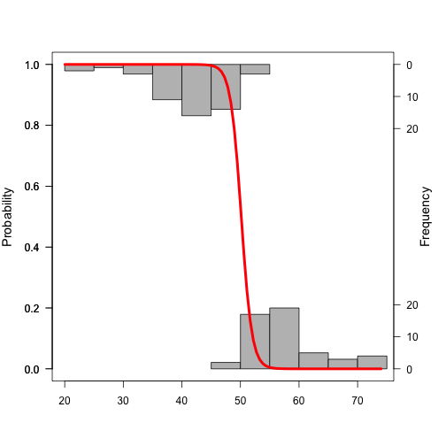

# What is this?
  
## This is a presentation...

- These slides were created in markdown
- Knitr allows for inline R code in _.Rmd_ files
- Pandoc converts the _.md_ file to HTML5
- This is the result

## This is a subsection

- the ioslides template has unique features
- click "o" to see an overview of the presentation
- click "f" to go into full screen
- click 'w' toggle widescreen mode
- click "p" to see my presenter notes
- click "b" to take a break
- click "h" enable code highlight mode

<div class="notes">
This is my note.
- It can contain markdown
- like this list
</div>


# R test

## Fake data


```r
# Create some fake data
a <- rnorm(100,50,10)
a <- sort(a)
b <- c(rep(1,each=45),0,1,0,1,0,1,0,1,0,1,rep(0,each=45))
df <- as.data.frame(cbind(a,b))
head(df)
```

```
##       a b
## 1 20.03 1
## 2 24.86 1
## 3 28.10 1
## 4 30.88 1
## 5 33.37 1
## 6 33.78 1
```

# Fit a model

## Linear regression


```r
fit <- glm(b~a, data=df, family="binomial")
summary(fit)
```

```
## 
## Call:
## glm(formula = b ~ a, family = "binomial", data = df)
## 
## Deviance Residuals: 
##     Min       1Q   Median       3Q      Max  
## -2.0920  -0.0252   0.0000   0.0168   1.7417  
## 
## Coefficients:
##             Estimate Std. Error z value Pr(>|z|)   
## (Intercept)   55.067     17.831    3.09   0.0020 **
## a             -1.098      0.354   -3.11   0.0019 **
## ---
## Signif. codes:  0 '***' 0.001 '**' 0.01 '*' 0.05 '.' 0.1 ' ' 1
## 
## (Dispersion parameter for binomial family taken to be 1)
## 
##     Null deviance: 138.629  on 99  degrees of freedom
## Residual deviance:  20.324  on 98  degrees of freedom
## AIC: 24.32
## 
## Number of Fisher Scoring iterations: 9
```


## Test normality of residuals

```r
par(mfrow=c(1,2))
hist(residuals(fit))
qqnorm(residuals(fit))
qqline(residuals(fit))
```

 

# Full graphing capabilities

## Plot it


```r
plot(df$a,df$b,xlab="xlab",ylab="ylab") 
# draws a curve based on prediction from logistic regression model
curve(predict(fit,data.frame(a=x),type="resp"),add=TRUE) 
points(a,fitted(fit),pch=20) 
```

 

## Plot it

```r
library(popbio)
```

```
## Loading required package: quadprog
## 
## Attaching package: 'popbio'
## 
## The following object is masked from 'package:phonTools':
## 
##     resample
```

```r
logi.hist.plot(a,b,boxp=FALSE,type="hist",col="gray")
```

 


# Details

## RStudio 
The presentation was created using the following settings:

    ---
    title: "R example in markdown"
    author: "Joseph Casillas"
    date: ''
    output:
      ioslides_presentation:
        fig_height: 4
        fig_width: 8
        logo: figure/r.png
        smaller: yes
        transition: faster
        widescreen: yes
    ---

